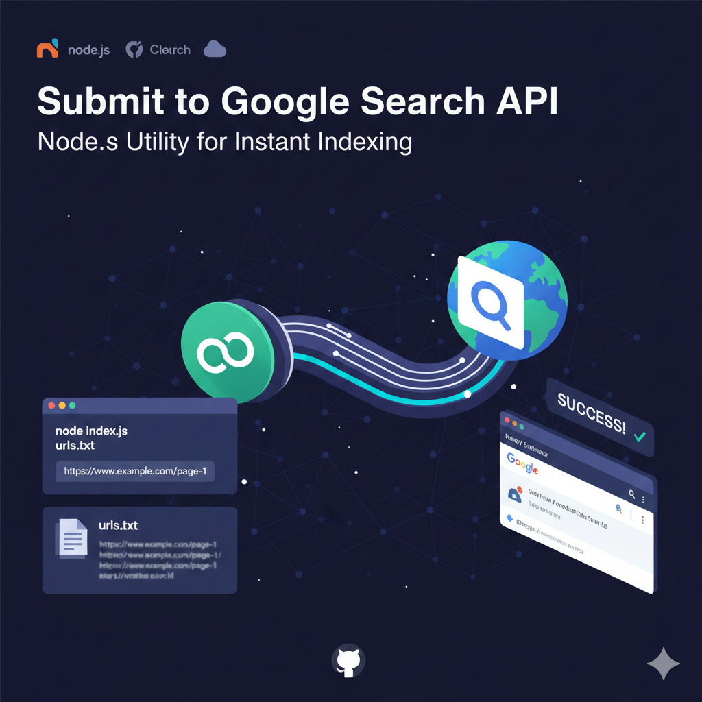

# Submit to Google Search API



A simple Node.js command line utility to programmatically submit URLs to the Google Search Console using the [Google Indexing API](https://developers.google.com/search/apis/indexing-api/v3/quickstart). This is useful for getting new or updated pages crawled immediately.

## Features

- **Single URL Submission:** Submit a specific URL on the fly.
- **Bulk Submission:** Read a list of URLs from a text file (`.txt`) and submit them all.
- **Smart Batching:** Automatically processes URLs in batches of 5 with a delay to respect API rate limits.
- **Error Handling:** Gracefully handles errors for individual URLs without stopping the entire batch.

## Prerequisites

1.  **Node.js**: Ensure Node.js is installed.
2.  **Google Cloud Project**:
    *   Enable the **Indexing API**.
    *   Create a **Service Account** and download the JSON key.
    *   **IMPORTANT:** Grant this Service Account's email address (found in the JSON) **Owner** access in your [Google Search Console](https://search.google.com/search-console) property settings.

## Setup

1.  Clone or download this repository.
2.  Install dependencies:
    ```bash
    npm install
    ```
3.  Place your Service Account key file in the root directory and rename it to:
    ```
    service_account.json
    ```

## Usage

### 1. Submit a Single URL
```bash
node index.js https://www.example.com/page-1
```

### 2. Submit Multiple URLs (from file)
Create a text file (e.g., `urls.txt`) with one URL per line:
```text
https://www.example.com/page-1
https://www.example.com/page-2
# This line is a comment and will be ignored
https://www.example.com/page-3
```

Then run:
```bash
node index.js urls.txt
```

### 3. Remove a URL
To notify Google that a page has been deleted (404/410):
```bash
node index.js https://www.example.com/old-page URL_DELETED
```
Or use a file:
```bash
node index.js urls_to_delete.txt URL_DELETED
```

## Troubleshooting

*   **403 Forbidden:** The Service Account does not have permission. Go to Google Search Console > Settings > Users and Permissions and ensure the service account email is added as an **Owner**.
*   **404 Not Found (API):** Ensure the Indexing API is enabled in your Google Cloud Project.

## Built by

This project was created by [Harish Garg](https://harishgarg.com).